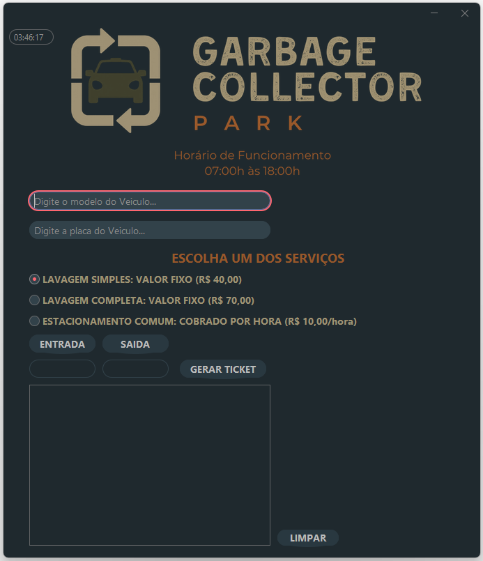

# 🚗 Sistema de Estacionamento Java


Sistema de gestão para estacionamento e estética automotiva
desenvolvido em Java com Swing e FlatLaf.

---

## 📸 Interface



---

## ✨ Funcionalidades

- Cadastro de veículos
- Controle de entrada e saída
- Emissão de ticket
- Relógio em tempo real
- Cálculo automático
- Interface moderna com FlatLaf

---

## 🛠 Tecnologias

- Java
- Swing
- FlatLaf
- Maven
- POO

---

## ▶ Como executar

```bash
git clone https://github.com/JeffhdSilva/Estacionamento_Java.git
```

Abra no NetBeans e execute o projeto.

---

## 📚 Conceitos utilizados

- Encapsulamento
- Herança
- Polimorfismo
- Interface gráfica
- Eventos Swing
